# SQL_MASTER 1주차 정규과제

📌SQL MASTER 정규과제는 매주 정해진 분량의 『*데이터 분석을 위한 SQL 레시피*』 를 읽고 학습하는 것입니다. 이번 주는 아래의 **SQL_MASTER_1st_TIL**에 나열된 분량을 읽고 공부하시면 됩니다.

아래 실습을 수행하며 학습 내용을 직접 적용해보세요. 단순히 결과를 재현하는 것이 아니라, SQL을 직접 작성하는 과정에서 개념을 스스로 정리하는 것이 중요합니다.

필요한 경우 교재와 추가 자료를 참고하여 이해를 보완하시기 바랍니다.

## SQL_MASTER_1st_TIL

### 3장 데이터 가공믈 위한 SQL
#### 1. 하나의 값 조작하기
#### 2. 여러 개의 값에 대한 조작
#### 3. 하나의 테이블에 대한 조작
#### 4. 여러 개의 테이블 조작하기


## Study Schedule

| 주차  | 공부 범위     | 완료 여부 |
| ----- | ------------- | --------- |
| 1주차 | p.52~136   | ✅         |
| 2주차 | p.138~184  | 🍽️         |
| 3주차 | p.186~232 | 🍽️         |
| 4주차 | p.233~321 | 🍽️         |
| 5주차 | p.324~406 | 🍽️         |
| 6주차 | p.408~464 | 🍽️         |
| 7주차 | p.466~566 | 🍽️         |

<br>

<!-- 여기까진 그대로 둬 주세요-->


# 실습

## 0. 실습 규칙

1. 샘플 데이터 생성 코드는 **08_SQL_MASTER_Template/src** 경로에 장별로 정리되어 있습니다.
2. 아래 목차에 맞춰 해당 코드를 실행하여 샘플 데이터를 생성한 후, 각 장에서 요구하는 쿼리를 직접 작성해보시기 바랍니다.
3. 작성한 쿼리의 **실행 결과 화면도 함께 제출**해 주세요.
4. 단순히 교재의 예시 코드를 그대로 작성하는 것이 아니라, **제시된 로직을 충분히 이해한 뒤 교재를 보지 않고 스스로 쿼리를 구성**해보는 것을 권장합니다.
5. 교재 예시는 PostgreSQL, Hive, BigQuery 등 다양한 DBMS 기준으로 제시되어 있기 때문에, **MySQL이 아닌 다른 SQL 환경을 사용하여 실습을 진행해도 무방합니다.**
6. 다만, 사용 중인 DBMS에 맞는 문법으로 적절히 변환하여 작성하시기 바랍니다.

## 1. 하나의 값 조작하기 

### 1-1 코드 값을 레이블로 변경하기

```sql
SELECT
  user_id,
  CASE register_device
    WHEN 1 THEN '데스크톱'
    WHEN 2 THEN '스마트폰'
    WHEN 3 THEN '애플리케이션'
    ELSE '알 수 없음'
  END AS device_name
FROM mst_users
ORDER BY user_id;
```

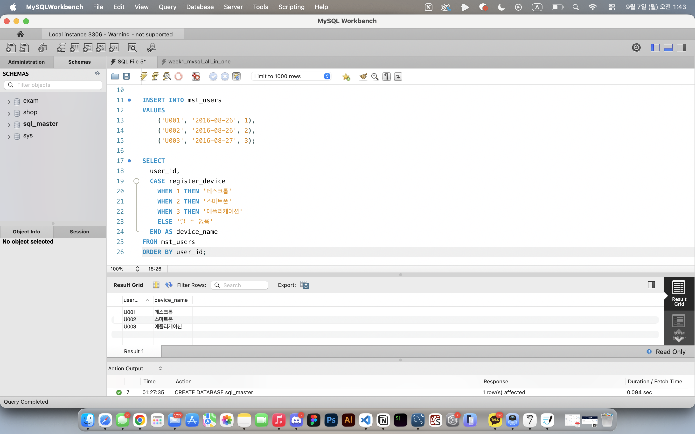
<br>


### 1-2 URL에서 요소 추출하기

```sql
WITH url_parts AS (
    SELECT
        stamp,
        referrer,
        url,
        SUBSTRING_INDEX(
            SUBSTRING_INDEX(referrer, '://', -1),
            '/',
            1
        ) AS referrer_host,
        SUBSTRING_INDEX(url, '://', -1) AS url_no_scheme
    FROM access_log
)

SELECT
    stamp,
    referrer_host,
    url,

    -- URL에서 경로 추출
    SUBSTRING(
        SUBSTRING_INDEX(
            SUBSTRING_INDEX(url_no_scheme, '?', 1),
            '#',
            1
        ),
        LOCATE('/', url_no_scheme)
    ) AS path,

    -- GET 요청 매개변수 id 추출
    CASE
        WHEN url LIKE '%id=%'
        THEN SUBSTRING_INDEX(
                 SUBSTRING_INDEX(url, 'id=', -1),
                 '&',
                 1
             )
    END AS id

FROM url_parts;
```
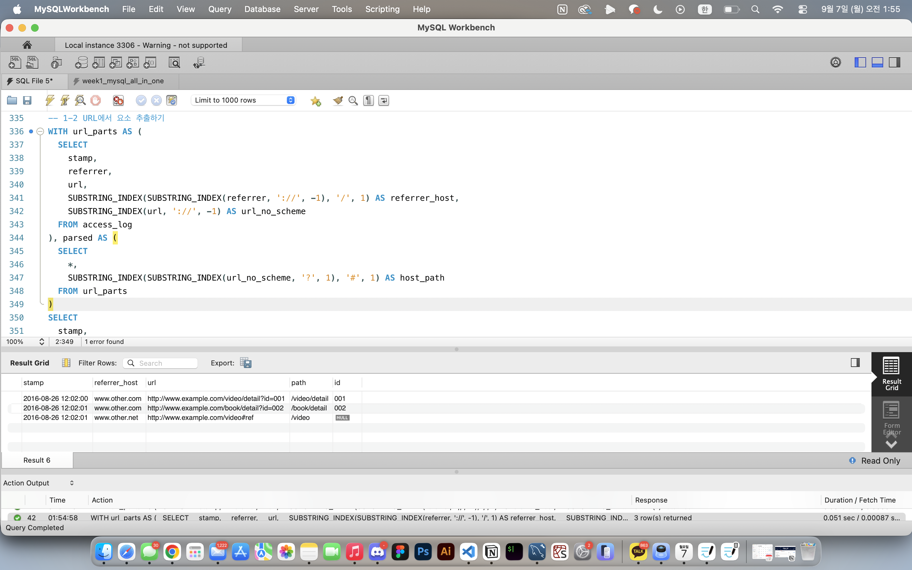
<br>


### 1-3 문자열을 배열로 분해하기

- MySQL에는 교재의 split_part/split 배열 문법이 없으므로
-  SUBSTRING_INDEX로 경로의 n번째 요소를 꺼낸다.

```sql
WITH parsed AS (
    SELECT
        stamp,
        url,
        SUBSTRING_INDEX(
            SUBSTRING_INDEX(
                SUBSTRING_INDEX(url, '://', -1),
                '?', 1
            ),
            '#', 1
        ) AS host_path
    FROM access_log
)

SELECT
    stamp,
    url,

    -- 첫 번째 경로
    SUBSTRING_INDEX(
        SUBSTRING_INDEX(host_path, '/', 2),
        '/', -1
    ) AS path1,

    -- 두 번째 경로
    CASE
        WHEN host_path LIKE '%/%/%'
        THEN SUBSTRING_INDEX(
                 SUBSTRING_INDEX(host_path, '/', 3),
                 '/', -1
             )
    END AS path2

FROM parsed;
```

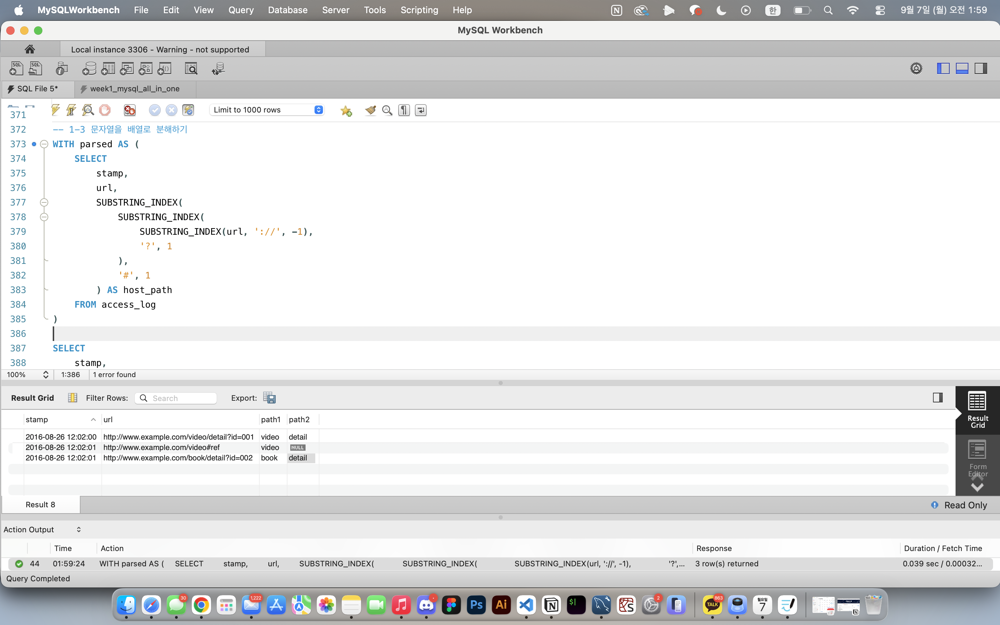
<br>


### 1-4 날짜와 타임스탬프 다루기

```sql
SELECT
    CURRENT_DATE() AS current_date_value,
    CURRENT_TIMESTAMP() AS current_timestamp_value,
    stamp,
    YEAR(stamp) AS year_value,
    MONTH(stamp) AS month_value,
    DAY(stamp) AS day_value,
    HOUR(stamp) AS hour_value,
    DATE_FORMAT(stamp, '%Y-%m') AS `year_month`
FROM (
    SELECT CAST('2016-01-30 12:00:00' AS DATETIME) AS stamp
) AS t;
```

<br>

### 1-5 결손 값을 디폴트 값으로 대치하기

```sql
CREATE TABLE purchase_log_with_coupon (
  purchase_id VARCHAR(255),
  amount INT,
  coupon INT
);
INSERT INTO purchase_log_with_coupon VALUES
('10001', 3280, NULL),
('10002', 4650, 500),
('10003', 3870, NULL);
```

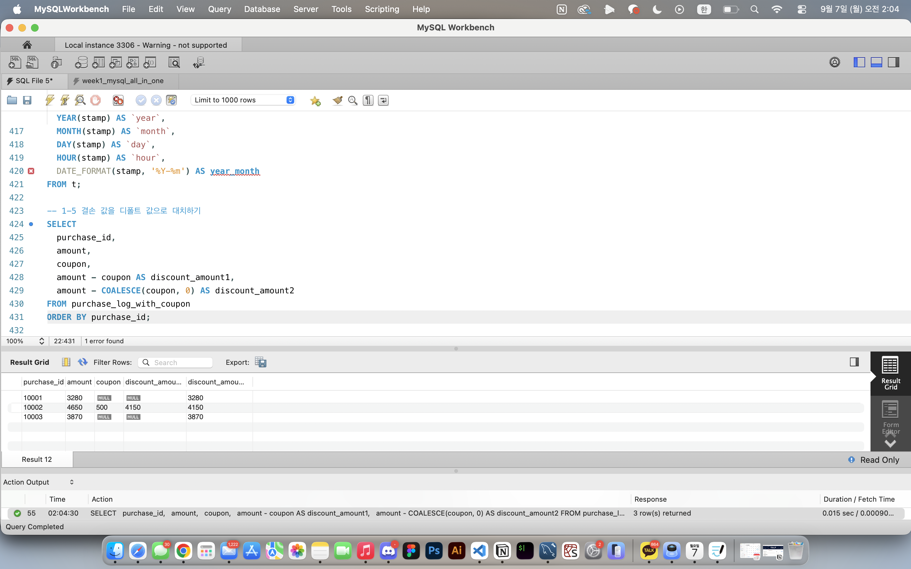
<br>


## 2. 여러 개의 값에 대한 조작 

### 2-1 문자열을 연결하기

<!-- 이 부분을 지우고 새롭게 배운 내용을 자유롭게 정리해주세요. -->

```sql
SELECT
  user_id,
  pref_name,
  city_name,
  CONCAT(pref_name, city_name) AS pref_city
FROM mst_user_location
ORDER BY user_id;
```
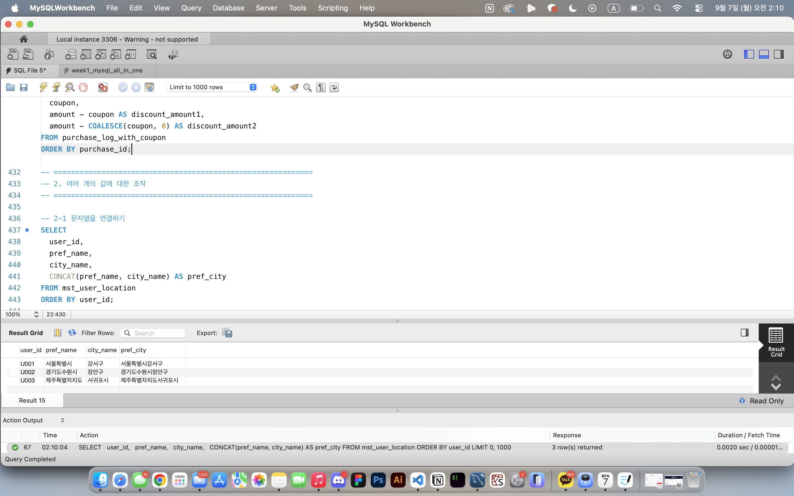
<br>

### 2-2 여러 개의 값을 비교하기

<!-- 이 부분을 지우고 새롭게 배운 내용을 자유롭게 정리해주세요. -->

```sql
SELECT
  `year`,
  q1,
  q2,
  CASE
    WHEN q1 < q2 THEN '+'
    WHEN q1 = q2 THEN ''
    ELSE '-'
  END AS judge_q1_q2,
  q2 - q1 AS diff_q2_q1,
  SIGN(q2 - q1) AS sign_q2_q1
FROM quarterly_sales
ORDER BY `year`;
```
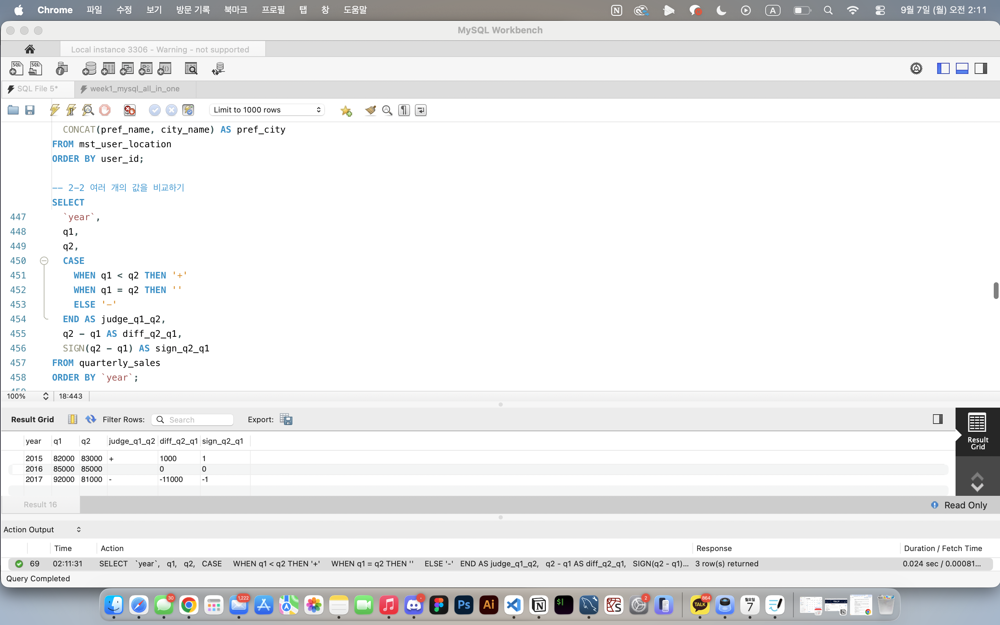
<br>

### 2-3 2개의 값 비율 계산하기

```sql
SELECT
  dt,
  ad_id,
  impressions,
  clicks,
  100.0 * clicks / NULLIF(impressions, 0) AS ctr_percent
FROM advertising_stats
ORDER BY dt, ad_id;
```

<br>


### 2-4 두 값의 거리 계산하기

```sql
-- 2-4 두 값의 거리 계산하기
-- 1차원
SELECT
  x1,
  x2,
  ABS(x1 - x2) AS abs_distance,
  SQRT(POWER(x1 - x2, 2)) AS rms_distance
FROM location_1d;

-- 2차원 유클리드 거리
SELECT
  x1,
  y1,
  x2,
  y2,
  SQRT(POWER(x1 - x2, 2) + POWER(y1 - y2, 2)) AS euclidean_distance
FROM location_2d;
```
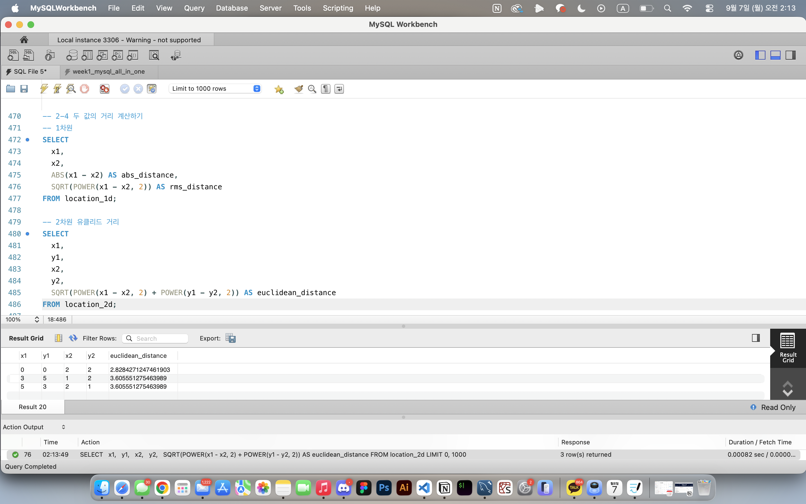
<br>

### 2-5 날짜/시간을 계산하기

```sql
SELECT
  user_id,
  CAST(register_stamp AS DATETIME) AS register_stamp,
  DATE_ADD(CAST(register_stamp AS DATETIME), INTERVAL 1 HOUR) AS after_1_hour,
  DATE_SUB(CAST(register_stamp AS DATETIME), INTERVAL 30 MINUTE) AS before_30_minutes,
  DATE(CAST(register_stamp AS DATETIME)) AS register_date,
  DATE_ADD(DATE(CAST(register_stamp AS DATETIME)), INTERVAL 1 DAY) AS after_1_day,
  DATE_SUB(DATE(CAST(register_stamp AS DATETIME)), INTERVAL 1 MONTH) AS before_1_month,
  TIMESTAMPDIFF(
    YEAR,
    CAST(birth_date AS DATE),
    DATE(CAST(register_stamp AS DATETIME))
  ) AS age_at_register
FROM mst_users_with_dates
ORDER BY user_id;
```
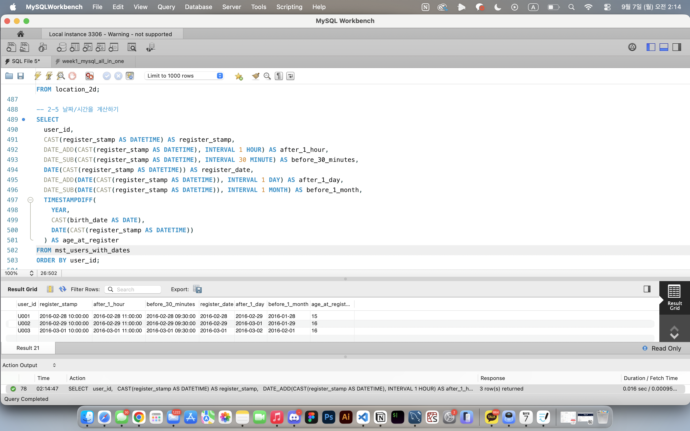
<br>

### 2-6 IP 주소 다루기

```sql
WITH t AS (
  SELECT '192.168.0.1' AS ip
)
SELECT
  ip,
  CAST(SUBSTRING_INDEX(ip, '.', 1) AS UNSIGNED) AS ip_part_1,
  CAST(SUBSTRING_INDEX(SUBSTRING_INDEX(ip, '.', 2), '.', -1) AS UNSIGNED) AS ip_part_2,
  CAST(SUBSTRING_INDEX(SUBSTRING_INDEX(ip, '.', 3), '.', -1) AS UNSIGNED) AS ip_part_3,
  CAST(SUBSTRING_INDEX(ip, '.', -1) AS UNSIGNED) AS ip_part_4,
  INET_ATON(ip) AS ip_integer,
  INET_NTOA(INET_ATON(ip)) AS restored_ip
FROM t;
```
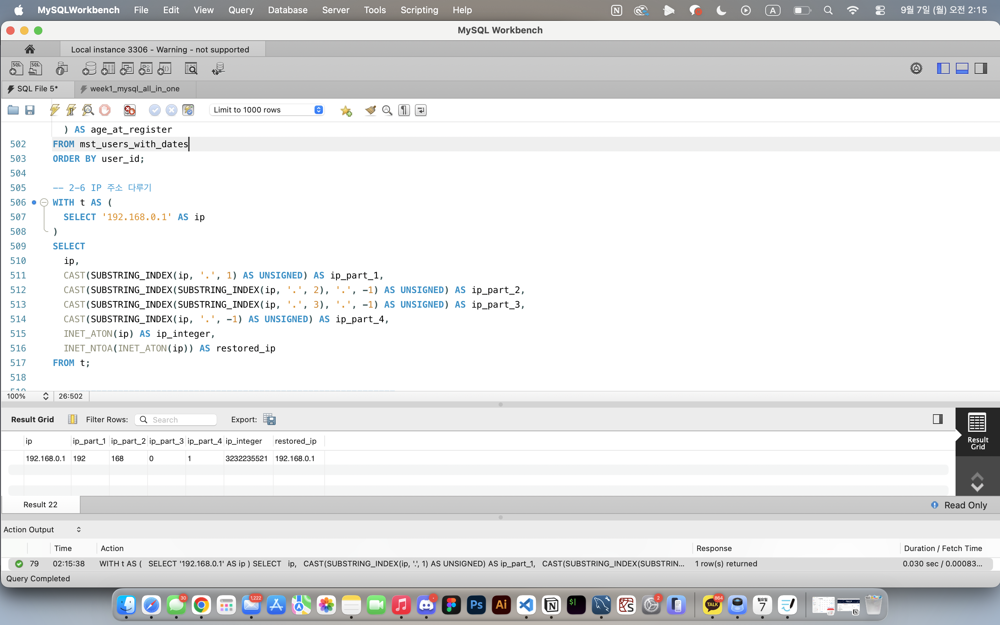
<br>

## 03. 하나의 테이블에 대한 조작 

### 3-1 그룹의 특징 잡기

```sql
-- 테이블 전체 특징량
SELECT
  COUNT(*) AS total_count,
  COUNT(DISTINCT user_id) AS user_count,
  COUNT(DISTINCT product_id) AS product_count,
  SUM(score) AS score_sum,
  AVG(score) AS score_avg,
  MAX(score) AS score_max,
  MIN(score) AS score_min
FROM review;

-- 사용자별 특징량
SELECT
  user_id,
  COUNT(*) AS review_count,
  AVG(score) AS avg_score,
  MAX(score) AS max_score,
  MIN(score) AS min_score
FROM review
GROUP BY user_id
ORDER BY user_id;
```
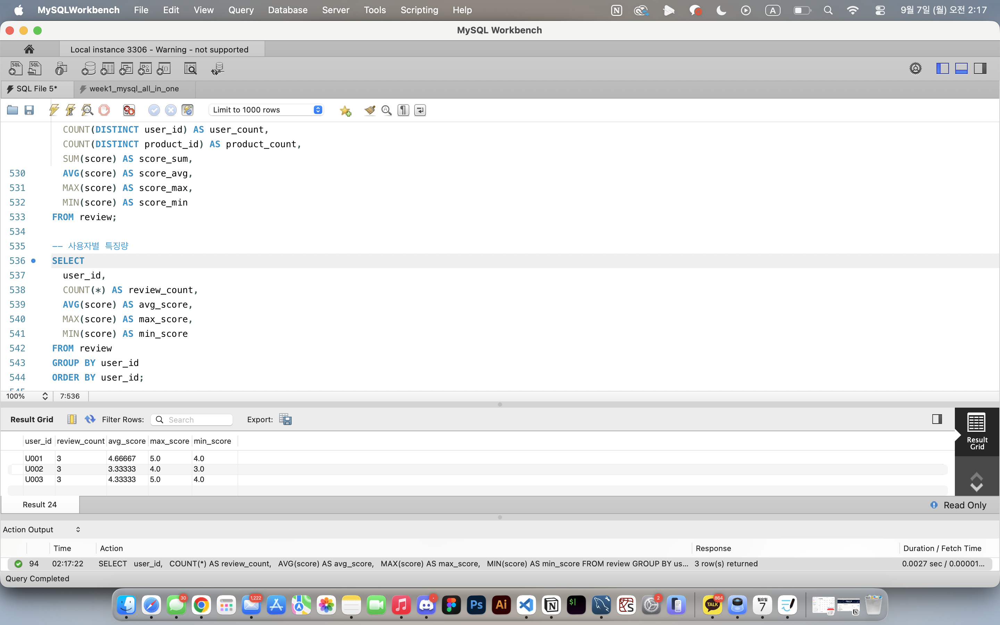
<br>

### 3-2 그룹 내부의 순서

```sql
SELECT
  category,
  product_id,
  score,
  ROW_NUMBER() OVER (
    PARTITION BY category
    ORDER BY score DESC, product_id
  ) AS row_num,
  RANK() OVER (
    PARTITION BY category
    ORDER BY score DESC
  ) AS ranking,
  DENSE_RANK() OVER (
    PARTITION BY category
    ORDER BY score DESC
  ) AS dense_ranking,
  LAG(product_id) OVER (
    PARTITION BY category
    ORDER BY score DESC, product_id
  ) AS prev_product,
  LEAD(product_id) OVER (
    PARTITION BY category
    ORDER BY score DESC, product_id
  ) AS next_product
FROM popular_products
ORDER BY category, row_num;
```
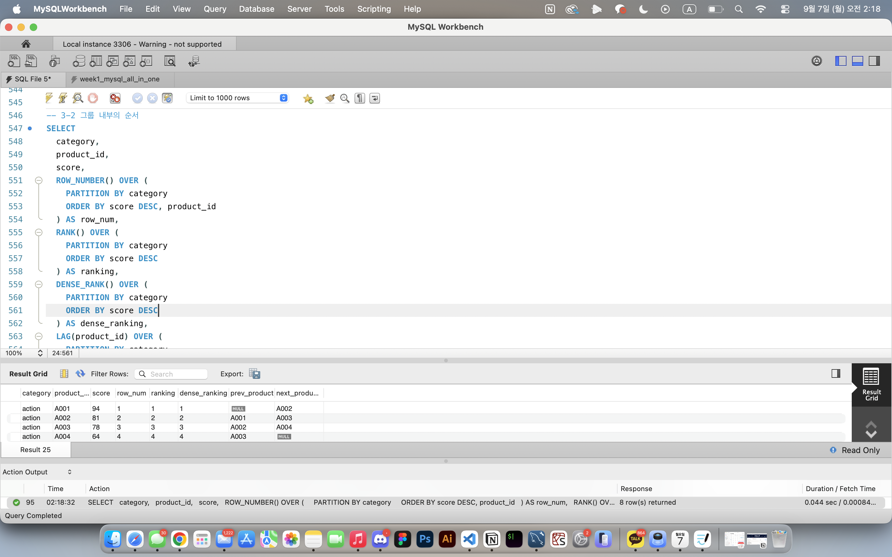
<br>

### 3-3 세로 기반 데이터를 가로 기반으로 변환하기

```sql
SELECT
  dt,
  MAX(CASE WHEN indicator = 'impressions' THEN val END) AS impressions,
  MAX(CASE WHEN indicator = 'sessions' THEN val END) AS sessions,
  MAX(CASE WHEN indicator = 'users' THEN val END) AS users
FROM daily_kpi
GROUP BY dt
ORDER BY dt;
```
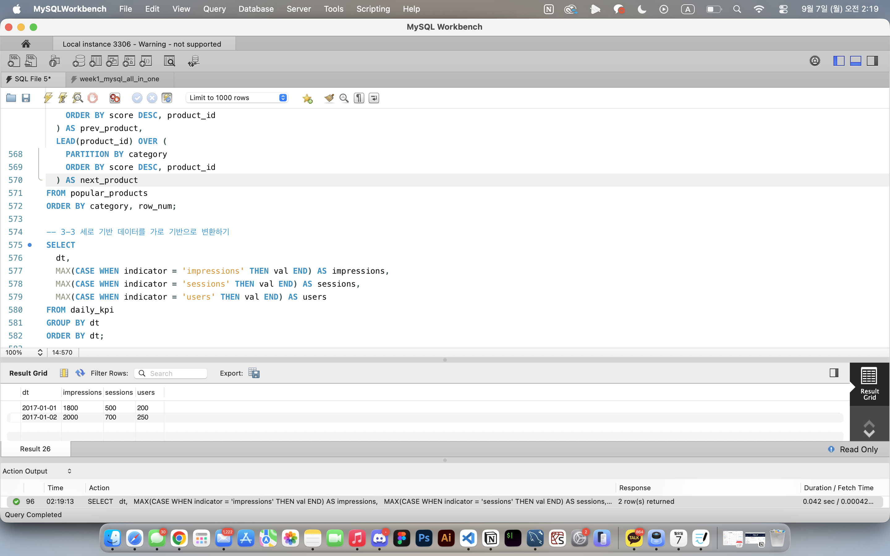
<br>

### 3-4 가로 기반 데이터를 세로 기반으로 변환하기

```sql
-- 분기 컬럼을 행으로 변환
SELECT `year`, 'q1' AS quarter, q1 AS sales FROM quarterly_sales
UNION ALL
SELECT `year`, 'q2', q2 FROM quarterly_sales
UNION ALL
SELECT `year`, 'q3', q3 FROM quarterly_sales
UNION ALL
SELECT `year`, 'q4', q4 FROM quarterly_sales
ORDER BY `year`, quarter;

-- 쉼표로 연결된 product_ids를 행으로 분해(MySQL 8.0 JSON_TABLE 이용)
SELECT
  p.purchase_id,
  jt.product_id
FROM purchase_log_products AS p
JOIN JSON_TABLE(
  CONCAT('["', REPLACE(p.product_ids, ',', '","'), '"]'),
  '$[*]' COLUMNS(
    product_id VARCHAR(255) PATH '$'
  )
) AS jt ON TRUE
ORDER BY p.purchase_id, jt.product_id;
```
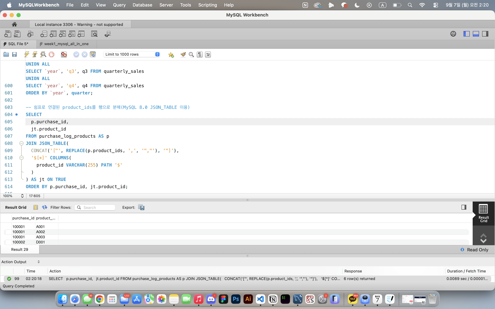
<br>

## 04. 여러 개의 테이블 조작하기

### 4-1 여러 개의 테이블을 세로로 결합하기

```sql
SELECT
  'app1' AS app_name,
  user_id,
  name,
  email
FROM app1_mst_users
UNION ALL
SELECT
  'app2' AS app_name,
  user_id,
  name,
  NULL AS email
FROM app2_mst_users
ORDER BY app_name, user_id;
```
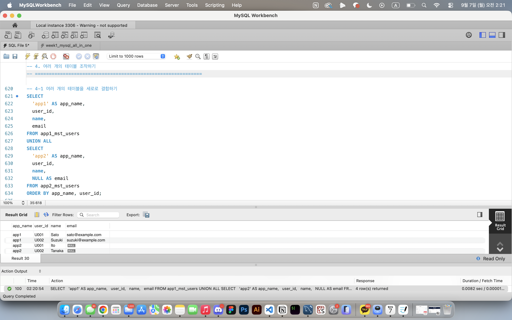
<br>

### 4-2 여러 개의 테이블을 가로로 정렬하기

```sql
SELECT
  m.category_id,
  m.name,
  s.sales,
  r.product_id AS top_sale_product
FROM mst_categories AS m
LEFT JOIN category_sales AS s
  ON m.category_id = s.category_id
LEFT JOIN product_sale_ranking AS r
  ON m.category_id = r.category_id
 AND r.`rank` = 1
ORDER BY m.category_id;
```

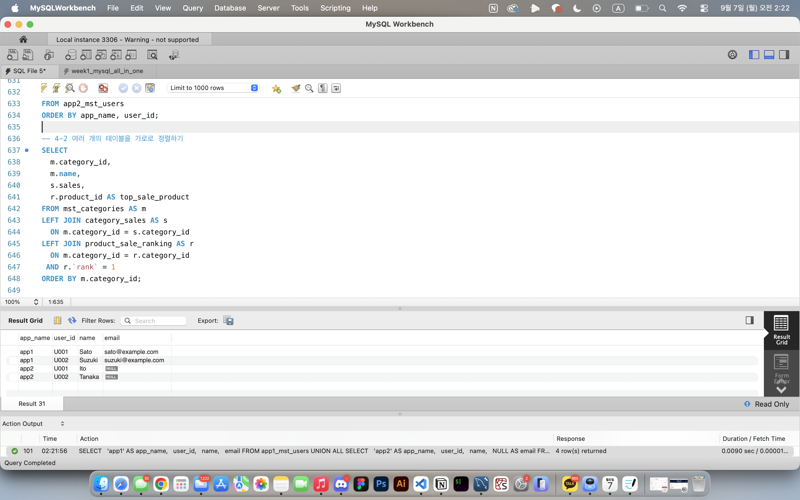
<br>

### 4-3 조건 플래그를 0과 1로 표현하기

```sql
SELECT
  m.user_id,
  m.card_number,
  COUNT(p.user_id) AS purchase_count,
  CASE
    WHEN m.card_number IS NOT NULL THEN 1
    ELSE 0
  END AS has_card,
  SIGN(COUNT(p.user_id)) AS has_purchased
FROM mst_users_with_card_number AS m
LEFT JOIN purchase_log AS p
  ON m.user_id = p.user_id
GROUP BY m.user_id, m.card_number
ORDER BY m.user_id;
```

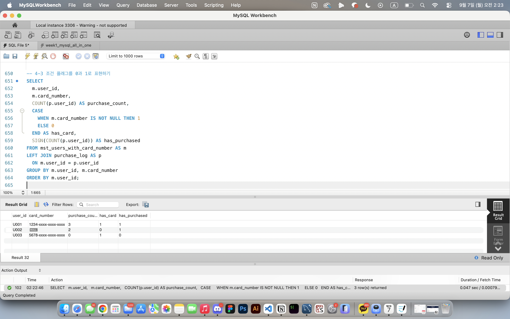
<br>

### 4-4 계산한 테이블에 이름 붙여 재사용하기

```sql
WITH product_sale_ranking_cte AS (
  SELECT
    category_name,
    product_id,
    sales,
    ROW_NUMBER() OVER (
      PARTITION BY category_name
      ORDER BY sales DESC, product_id
    ) AS sales_rank
  FROM product_sales
)
SELECT
  r1.category_name,
  r1.product_id AS rank1_product,
  r1.sales AS rank1_sales,
  r2.product_id AS rank2_product,
  r2.sales AS rank2_sales,
  r3.product_id AS rank3_product,
  r3.sales AS rank3_sales
FROM product_sale_ranking_cte AS r1
LEFT JOIN product_sale_ranking_cte AS r2
  ON r1.category_name = r2.category_name
 AND r2.sales_rank = 2
LEFT JOIN product_sale_ranking_cte AS r3
  ON r1.category_name = r3.category_name
 AND r3.sales_rank = 3
WHERE r1.sales_rank = 1
ORDER BY r1.category_name;
```


<br>

### 4-5 유사 테이블 만들기

```sql
WITH mst_devices AS (
  SELECT 1 AS device_id, 'PC' AS device_name
  UNION ALL
  SELECT 2, 'SP'
  UNION ALL
  SELECT 3, '애플리케이션'
)
SELECT *
FROM mst_devices
ORDER BY device_id;
```


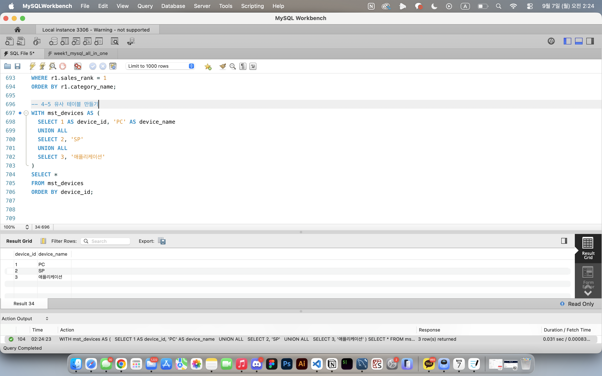
<br>
<br>
<br>

### 🎉 수고하셨습니다.
