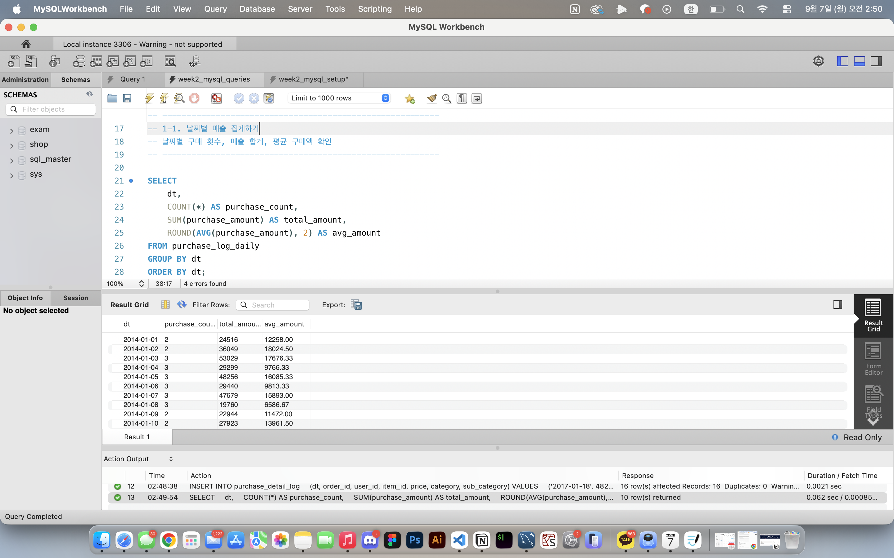
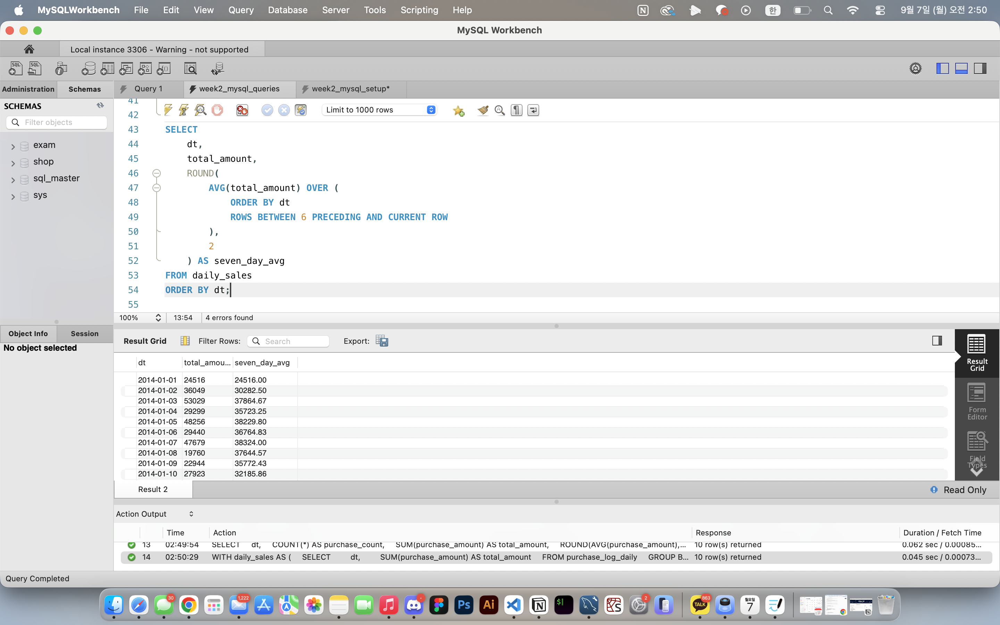
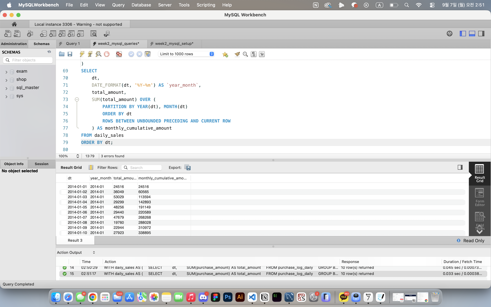
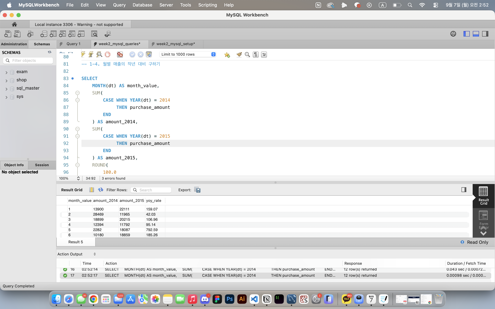
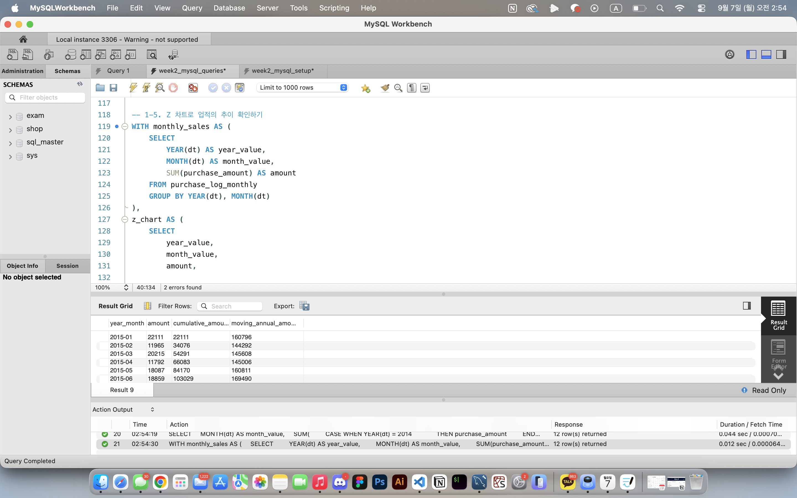
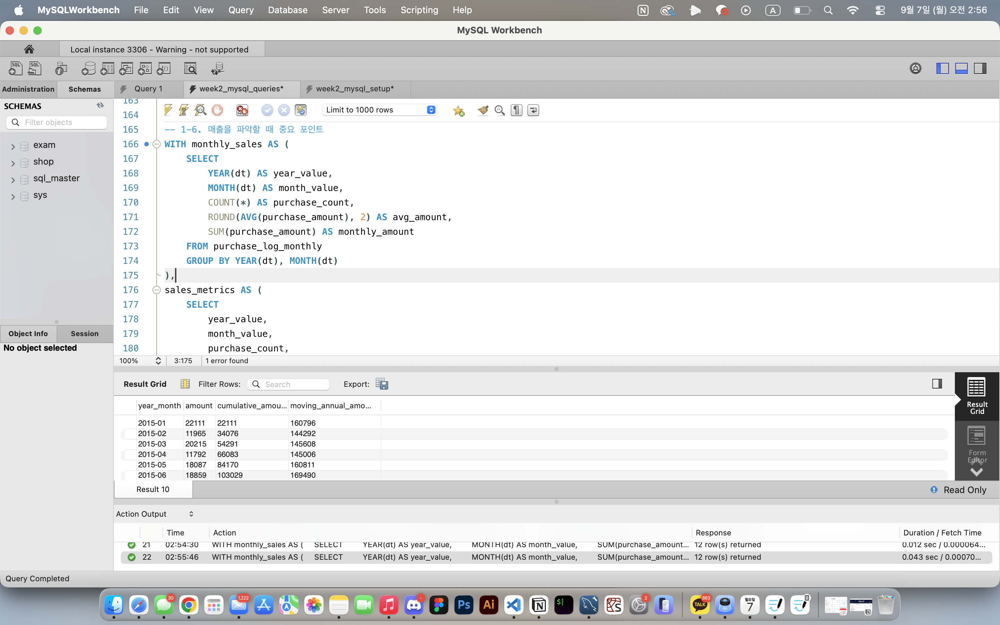
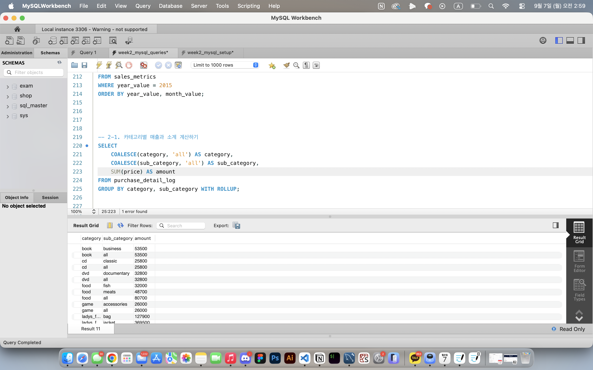
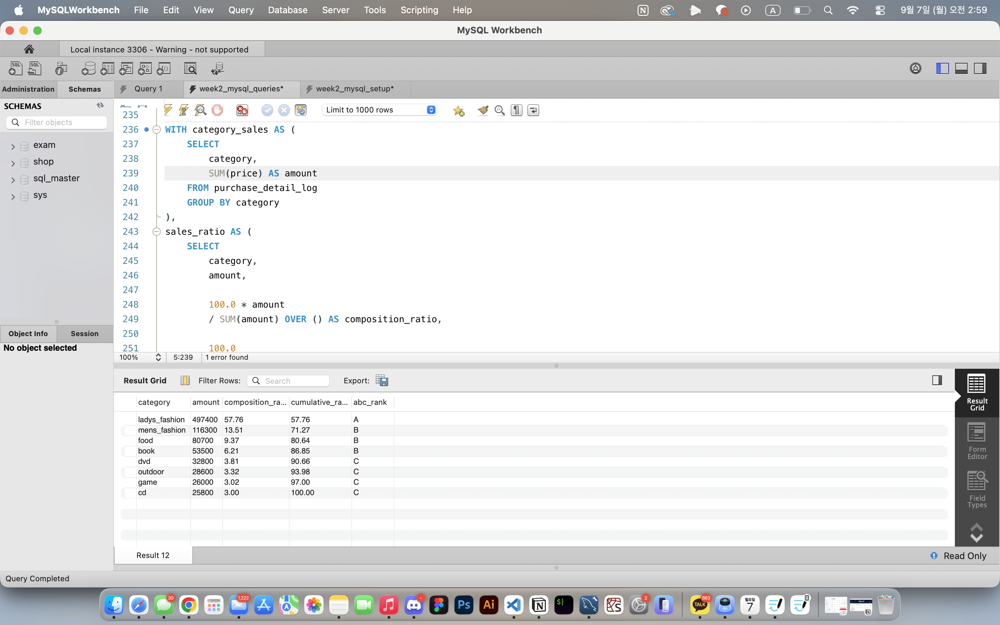
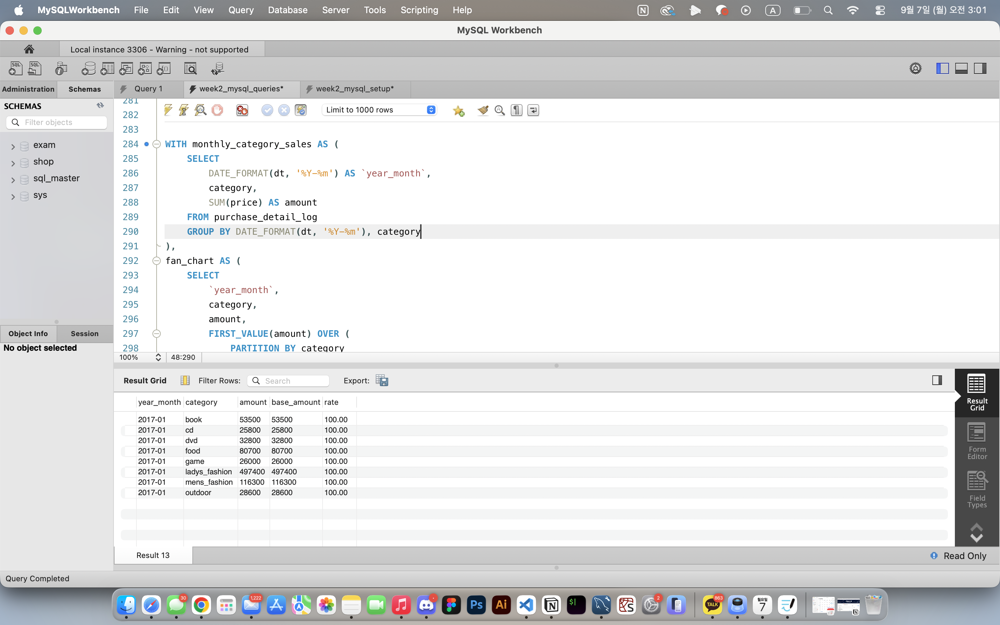
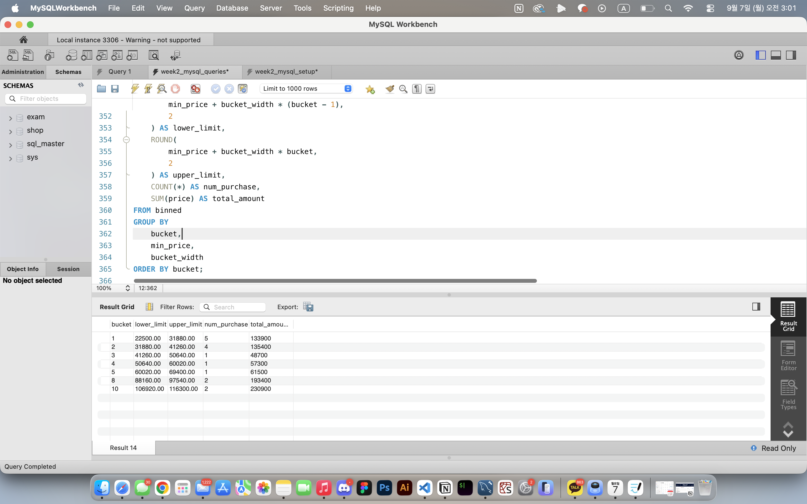

# SQL_MASTER 2주차 정규과제

📌SQL MASTER 정규과제는 매주 정해진 분량의 『*데이터 분석을 위한 SQL 레시피*』 를 읽고 학습하는 것입니다. 이번 주는 아래의 **SQL_MASTER_2nd_TIL**에 나열된 분량을 읽고 공부하시면 됩니다.

아래 실습을 수행하며 학습 내용을 직접 적용해보세요. 단순히 결과를 재현하는 것이 아니라, SQL을 직접 작성하는 과정에서 개념을 스스로 정리하는 것이 중요합니다.

필요한 경우 교재와 추가 자료를 참고하여 이해를 보완하시기 바랍니다.

## SQL_MASTER_2nd_TIL

### 4장 매출을 파악하기 위한 데이터 추출
#### 1. 시계열 기반으로 데이터 집계하기
#### 2. 다면적인 축을 사용해 데이터 집계하기 


## Study Schedule

| 주차  | 공부 범위     | 완료 여부 |
| ----- | ------------- | --------- |
| 1주차 | p.52~136   | ✅         |
| 2주차 | p.138~184  | ✅         |
| 3주차 | p.186~232 | 🍽️         |
| 4주차 | p.233~321 | 🍽️         |
| 5주차 | p.324~406 | 🍽️         |
| 6주차 | p.408~464 | 🍽️         |
| 7주차 | p.466~566 | 🍽️         |

<br>

<!-- 여기까진 그대로 둬 주세요-->

# 실습

## 0. 실습 규칙

1. 샘플 데이터 생성 코드는 **08_SQL_MASTER_Template/src** 경로에 장별로 정리되어 있습니다.
2. 아래 목차에 맞춰 해당 코드를 실행하여 샘플 데이터를 생성한 후, 각 장에서 요구하는 쿼리를 직접 작성해보시기 바랍니다.
3. 작성한 쿼리의 **실행 결과 화면도 함께 제출**해 주세요.
4. 단순히 교재의 예시 코드를 그대로 작성하는 것이 아니라, **제시된 로직을 충분히 이해한 뒤 교재를 보지 않고 스스로 쿼리를 구성**해보는 것을 권장합니다.
5. 교재 예시는 PostgreSQL, Hive, BigQuery 등 다양한 DBMS 기준으로 제시되어 있기 때문에, **MySQL이 아닌 다른 SQL 환경을 사용하여 실습을 진행해도 무방합니다.**
6. 다만, 사용 중인 DBMS에 맞는 문법으로 적절히 변환하여 작성하시기 바랍니다.


## 1. 시계열 기반으로 데이터 집계하기

### 1-1 날짜별 매출 집계하기

```sql
DROP DATABASE dartb_sql_master_week2;

CREATE DATABASE dartb_sql_master_week2
  DEFAULT CHARACTER SET utf8mb4
  DEFAULT COLLATE utf8mb4_0900_ai_ci;

USE dartb_sql_master_week2;
```


<br>
 
### 1-2 이동평균을 사용한 날짜별 추이 보기

```sql
DROP DATABASE dartb_sql_master_week2;

CREATE DATABASE dartb_sql_master_week2
  DEFAULT CHARACTER SET utf8mb4
  DEFAULT COLLATE utf8mb4_0900_ai_ci;

USE dartb_sql_master_week2;
```


<br>
 
### 1-3 당월 매출 누계 구하기

```sql
WITH daily_sales AS (
    SELECT
        dt,
        SUM(purchase_amount) AS total_amount
    FROM purchase_log_daily
    GROUP BY dt
)
SELECT
    dt,
    DATE_FORMAT(dt, '%Y-%m') AS `year_month`,
    total_amount,
    SUM(total_amount) OVER (
        PARTITION BY YEAR(dt), MONTH(dt)
        ORDER BY dt
        ROWS BETWEEN UNBOUNDED PRECEDING AND CURRENT ROW
    ) AS monthly_cumulative_amount
FROM daily_sales
ORDER BY dt;
```


<br>

### 1-4 월별 매출의 작대비 구하기

```sql
ELECT
    MONTH(dt) AS month_value,
    SUM(
        CASE WHEN YEAR(dt) = 2014
             THEN purchase_amount
        END
    ) AS amount_2014,
    SUM(
        CASE WHEN YEAR(dt) = 2015
             THEN purchase_amount
        END
    ) AS amount_2015,
    ROUND(
        100.0
        * SUM(
            CASE WHEN YEAR(dt) = 2015
                 THEN purchase_amount
            END
        )
        / NULLIF(
            SUM(
                CASE WHEN YEAR(dt) = 2014
                     THEN purchase_amount
                END
            ),
            0
        ),
        2
    ) AS yoy_rate
FROM purchase_log_monthly
GROUP BY MONTH(dt)
ORDER BY month_value;
```


<br>
 
### 1-5 Z 차트로 업적의 추이 확인하기

```sql
WITH monthly_sales AS (
    SELECT
        YEAR(dt) AS year_value,
        MONTH(dt) AS month_value,
        SUM(purchase_amount) AS amount
    FROM purchase_log_monthly
    GROUP BY YEAR(dt), MONTH(dt)
),
z_chart AS (
    SELECT
        year_value,
        month_value,
        amount,

        SUM(
            CASE WHEN year_value = 2015
                 THEN amount
                 ELSE 0
            END
        ) OVER (
            ORDER BY year_value, month_value
            ROWS BETWEEN UNBOUNDED PRECEDING AND CURRENT ROW
        ) AS cumulative_amount,

        SUM(amount) OVER (
            ORDER BY year_value, month_value
            ROWS BETWEEN 11 PRECEDING AND CURRENT ROW
        ) AS moving_annual_amount

    FROM monthly_sales
)
SELECT
    CONCAT(
        year_value,
        '-',
        LPAD(month_value, 2, '0')
    ) AS `year_month`,
    amount,
    cumulative_amount,
    moving_annual_amount
FROM z_chart
WHERE year_value = 2015
ORDER BY year_value, month_value;
```


<br>
 
### 1-6 매출을 파악할 때 중요 포인트 

```sql
WITH monthly_sales AS (
    SELECT
        YEAR(dt) AS year_value,
        MONTH(dt) AS month_value,
        COUNT(*) AS purchase_count,
        ROUND(AVG(purchase_amount), 2) AS avg_amount,
        SUM(purchase_amount) AS monthly_amount
    FROM purchase_log_monthly
    GROUP BY YEAR(dt), MONTH(dt)
),
sales_metrics AS (
    SELECT
        year_value,
        month_value,
        purchase_count,
        avg_amount,
        monthly_amount,

        SUM(monthly_amount) OVER (
            PARTITION BY year_value
            ORDER BY month_value
            ROWS BETWEEN UNBOUNDED PRECEDING AND CURRENT ROW
        ) AS cumulative_amount,

        LAG(monthly_amount, 12) OVER (
            ORDER BY year_value, month_value
        ) AS last_year_amount

    FROM monthly_sales
)
SELECT
    CONCAT(
        year_value,
        '-',
        LPAD(month_value, 2, '0')
    ) AS `year_month`,
    purchase_count,
    avg_amount,
    monthly_amount,
    cumulative_amount,
    last_year_amount,
    ROUND(
        100.0 * monthly_amount
        / NULLIF(last_year_amount, 0),
        2
    ) AS yoy_rate
FROM sales_metrics
WHERE year_value = 2015
ORDER BY year_value, month_value;
```


<br>


## 2. 다면적인 축을 사용해 데이터 집계하기 

### 2-1 카테고리별 매출과 소계 계산하기

```sql
SELECT
    COALESCE(category, 'all') AS category,
    COALESCE(sub_category, 'all') AS sub_category,
    SUM(price) AS amount
FROM purchase_detail_log
GROUP BY category, sub_category WITH ROLLUP;
```


<br>

### 2-2 ABC 분석으로 잘 팔리는 상품 판별하기

```sql
WITH category_sales AS (
    SELECT
        category,
        SUM(price) AS amount
    FROM purchase_detail_log
    GROUP BY category
),
sales_ratio AS (
    SELECT
        category,
        amount,

        100.0 * amount
        / SUM(amount) OVER () AS composition_ratio,

        100.0
        * SUM(amount) OVER (
            ORDER BY amount DESC
            ROWS BETWEEN UNBOUNDED PRECEDING AND CURRENT ROW
        )
        / SUM(amount) OVER () AS cumulative_ratio

    FROM category_sales
)
SELECT
    category,
    amount,
    ROUND(composition_ratio, 2) AS composition_ratio,
    ROUND(cumulative_ratio, 2) AS cumulative_ratio,
    CASE
        WHEN cumulative_ratio <= 70 THEN 'A'
        WHEN cumulative_ratio <= 90 THEN 'B'
        ELSE 'C'
    END AS abc_rank
FROM sales_ratio
ORDER BY amount DESC;
```


<br>

### 2-3 팬 차트로 상품의 매출 증가율 확인하기
- 각 카테고리의 첫 달 매출을 100으로 두고 이후 매출 비율 계산
- 여러 달 데이터가 있다면 같은 쿼리로 증감 추이를 확인할 수 있습니다.

```sql
WITH monthly_category_sales AS (
    SELECT
        DATE_FORMAT(dt, '%Y-%m') AS `year_month`,
        category,
        SUM(price) AS amount
    FROM purchase_detail_log
    GROUP BY DATE_FORMAT(dt, '%Y-%m'), category
),
fan_chart AS (
    SELECT
        `year_month`,
        category,
        amount,
        FIRST_VALUE(amount) OVER (
            PARTITION BY category
            ORDER BY `year_month`
            ROWS BETWEEN UNBOUNDED PRECEDING AND CURRENT ROW
        ) AS base_amount
    FROM monthly_category_sales
)
SELECT
    `year_month`,
    category,
    amount,
    base_amount,
    ROUND(
        100.0 * amount / NULLIF(base_amount, 0),
        2
    ) AS rate
FROM fan_chart
ORDER BY `year_month`, category;
```


<br>

### 2-4 히스토그램으로 구매 가격대 집계하기 

```sql
WITH stats AS (
    SELECT
        MIN(price) AS min_price,
        MAX(price) AS max_price,
        (MAX(price) - MIN(price)) / 10.0 AS bucket_width
    FROM purchase_detail_log
),
binned AS (
    SELECT
        p.price,
        s.min_price,
        s.max_price,
        s.bucket_width,

        LEAST(
            FLOOR(
                (p.price - s.min_price)
                / NULLIF(s.bucket_width, 0)
            ) + 1,
            10
        ) AS bucket

    FROM purchase_detail_log AS p
    CROSS JOIN stats AS s
)
SELECT
    bucket,
    ROUND(
        min_price + bucket_width * (bucket - 1),
        2
    ) AS lower_limit,
    ROUND(
        min_price + bucket_width * bucket,
        2
    ) AS upper_limit,
    COUNT(*) AS num_purchase,
    SUM(price) AS total_amount
FROM binned
GROUP BY
    bucket,
    min_price,
    bucket_width
ORDER BY bucket;
```


<br>


### 🎉 수고하셨습니다.
