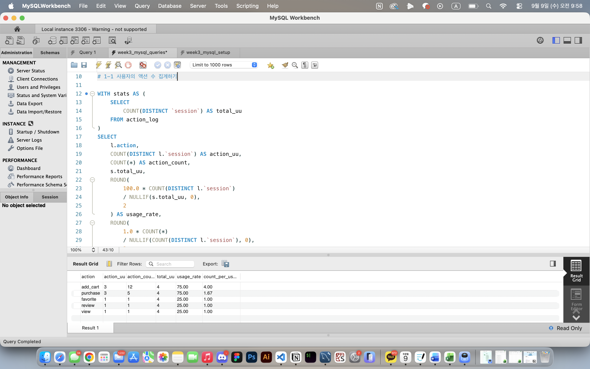
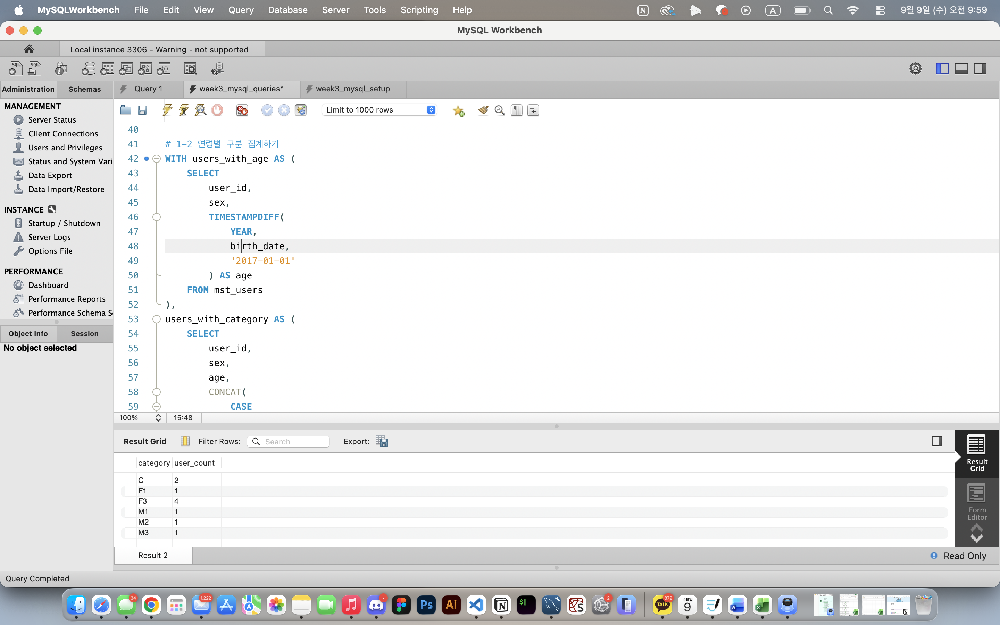
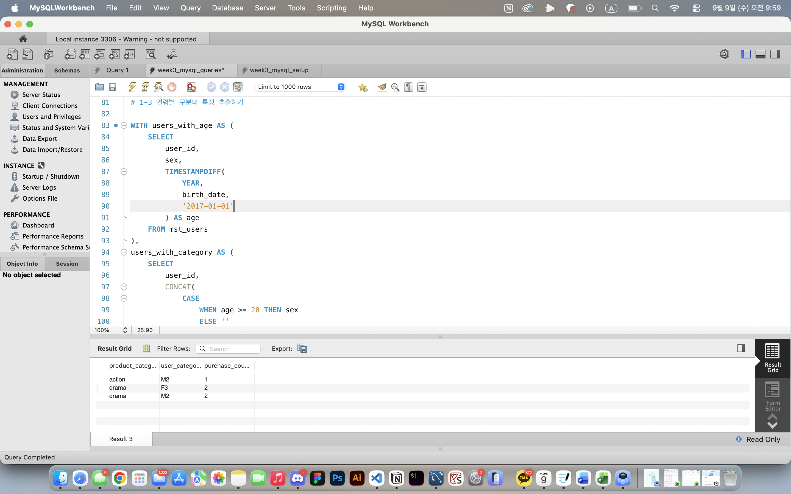
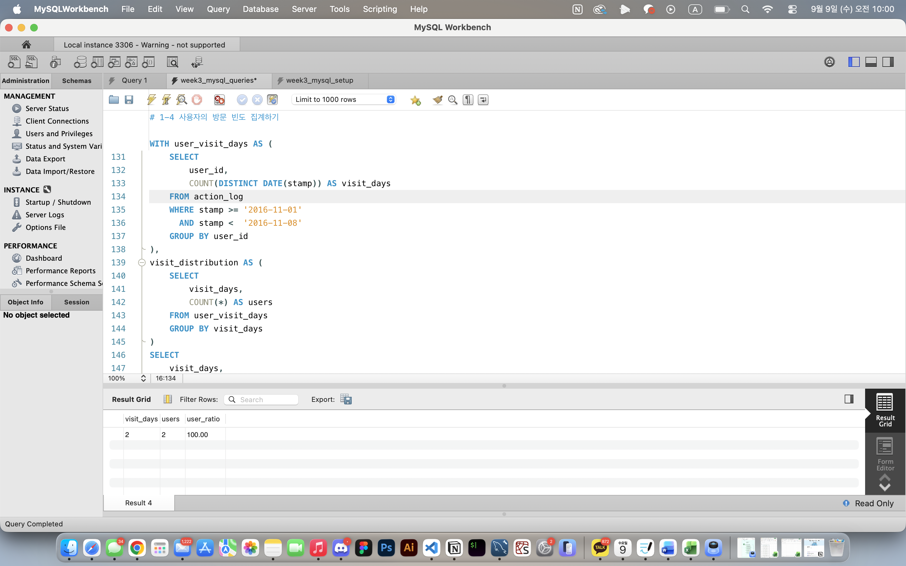
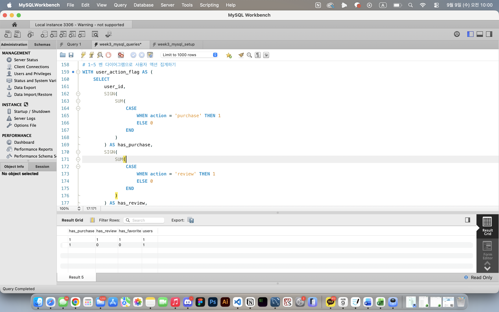
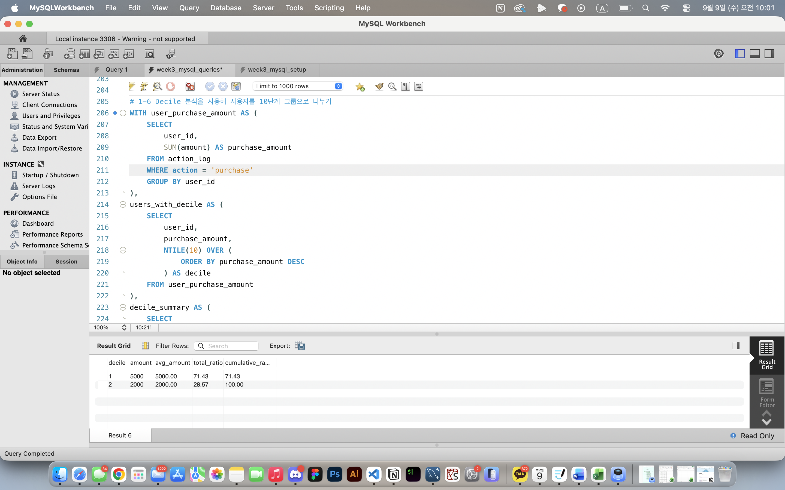
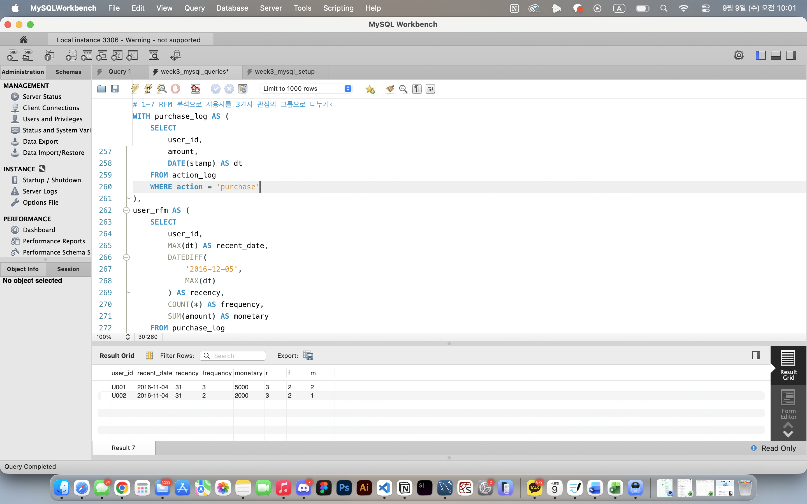

# SQL_MASTER 3주차 정규과제

📌SQL MASTER 정규과제는 매주 정해진 분량의 『*데이터 분석을 위한 SQL 레시피*』 를 읽고 학습하는 것입니다. 이번 주는 아래의 **SQL_MASTER_3rd_TIL**에 나열된 분량을 읽고 공부하시면 됩니다.

아래 실습을 수행하며 학습 내용을 직접 적용해보세요. 단순히 결과를 재현하는 것이 아니라, SQL을 직접 작성하는 과정에서 개념을 스스로 정리하는 것이 중요합니다.

필요한 경우 교재와 추가 자료를 참고하여 이해를 보완하시기 바랍니다.

## SQL_MASTER_3rd_TIL

### 5장 사용자를 파악하기 위한 데이터 추출
#### 1. 사용자 전체의 특징과 경향 찾기


## Study Schedule

| 주차  | 공부 범위     | 완료 여부 |
| ----- | ------------- | --------- |
| 1주차 | p.52~136   | ✅         |
| 2주차 | p.138~184  | ✅         |
| 3주차 | p.186~232 | ✅         |
| 4주차 | p.233~321 | 🍽️         |
| 5주차 | p.324~406 | 🍽️         |
| 6주차 | p.408~464 | 🍽️         |
| 7주차 | p.466~566 | 🍽️         |

<br>

<!-- 여기까진 그대로 둬 주세요-->


# 실습

## 0. 실습 규칙

1. 샘플 데이터 생성 코드는 **08_SQL_MASTER_Template/src** 경로에 장별로 정리되어 있습니다.
2. 아래 목차에 맞춰 해당 코드를 실행하여 샘플 데이터를 생성한 후, 각 장에서 요구하는 쿼리를 직접 작성해보시기 바랍니다.
3. 작성한 쿼리의 **실행 결과 화면도 함께 제출**해 주세요.
4. 단순히 교재의 예시 코드를 그대로 작성하는 것이 아니라, **제시된 로직을 충분히 이해한 뒤 교재를 보지 않고 스스로 쿼리를 구성**해보는 것을 권장합니다.
5. 교재 예시는 PostgreSQL, Hive, BigQuery 등 다양한 DBMS 기준으로 제시되어 있기 때문에, **MySQL이 아닌 다른 SQL 환경을 사용하여 실습을 진행해도 무방합니다.**
6. 다만, 사용 중인 DBMS에 맞는 문법으로 적절히 변환하여 작성하시기 바랍니다.

## 1. 사용자 전체의 특징과 경향 찾기

### 1-1 사용자의 액션 수 집계하기

#### `UU(Unique Users)`
: 중복을 제거한 사용자 수를 의미. 액션별 UU와 전체 UU를 비교하면 각 기능이 얼마나 사용되는지 파악 가능

| 지표 | 계산 |
| --- | --- |
| 사용률 | 액션 UU / 전체 UU × 100 |
| 1인당 액션 수 | 액션 횟수 / 액션 UU |

#### `COUNT(DISTINCT ...)`
: 중복을 제거한 수를 집계

```sql
WITH stats AS (
    SELECT
        COUNT(DISTINCT `session`) AS total_uu
    FROM action_log
)
SELECT
    l.action,
    COUNT(DISTINCT l.`session`) AS action_uu,
    COUNT(*) AS action_count,
    s.total_uu,
    ROUND(
        100.0 * COUNT(DISTINCT l.`session`)
        / NULLIF(s.total_uu, 0),
        2
    ) AS usage_rate,
    ROUND(
        1.0 * COUNT(*)
        / NULLIF(COUNT(DISTINCT l.`session`), 0),
        2
    ) AS count_per_user
FROM action_log AS l
CROSS JOIN stats AS s
GROUP BY
    l.action,
    s.total_uu
ORDER BY
    action_count DESC;
```



### 1-2 연령별 구분 집계하기

사용자의 나이를 그대로 비교하기보다 **연령 구간으로 범주화**하면 사용자 집단의 특징을 더 쉽게 파악할 수 있다.

| 구분 | 연령 |
| --- | --- |
| C | 4~12세 |
| T | 13~19세 |
| M1 / F1 | 20~34세 |
| M2 / F2 | 35~49세 |
| M3 / F3 | 50세 이상 |

➡️ *`CASE`로 연령 구간을 만들고, 성인 사용자는 성별과 연령 구간을 결합해 분류*

```sql
WITH users_with_age AS (
    SELECT
        user_id,
        sex,
        TIMESTAMPDIFF(
            YEAR,
            birth_date,
            '2017-01-01'
        ) AS age
    FROM mst_users
),
users_with_category AS (
    SELECT
        user_id,
        sex,
        age,
        CONCAT(
            CASE
                WHEN age >= 20 THEN sex
                ELSE ''
            END,
            CASE
                WHEN age BETWEEN 4 AND 12 THEN 'C'
                WHEN age BETWEEN 13 AND 19 THEN 'T'
                WHEN age BETWEEN 20 AND 34 THEN '1'
                WHEN age BETWEEN 35 AND 49 THEN '2'
                WHEN age >= 50 THEN '3'
            END
        ) AS category
    FROM users_with_age
)
SELECT
    category,
    COUNT(*) AS user_count
FROM users_with_category
GROUP BY category
ORDER BY category;
```



### 1-3 연령별 구분의 특징 추출하기

사용자 속성과 행동 로그를 `JOIN`하면 **어떤 사용자 집단이 어떤 상품을 주로 구매하는지** 확인 가능

- 사용자 마스터에서 연령 구분 생성
- 구매 로그와 `user_id`로 결합
- 상품 카테고리 × 사용자 구분별 구매 횟수를 `GROUP BY`로 집계

```sql
WITH users_with_age AS (
    SELECT
        user_id,
        sex,
        TIMESTAMPDIFF(
            YEAR,
            birth_date,
            '2017-01-01'
        ) AS age
    FROM mst_users
),
users_with_category AS (
    SELECT
        user_id,
        CONCAT(
            CASE
                WHEN age >= 20 THEN sex
                ELSE ''
            END,
            CASE
                WHEN age BETWEEN 4 AND 12 THEN 'C'
                WHEN age BETWEEN 13 AND 19 THEN 'T'
                WHEN age BETWEEN 20 AND 34 THEN '1'
                WHEN age BETWEEN 35 AND 49 THEN '2'
                WHEN age >= 50 THEN '3'
            END
        ) AS category
    FROM users_with_age
)
SELECT
    p.category AS product_category,
    u.category AS user_category,
    COUNT(*) AS purchase_count
FROM action_log AS p
JOIN users_with_category AS u
    ON p.user_id = u.user_id
WHERE p.action = 'purchase'
GROUP BY
    p.category,
    u.category
ORDER BY
    p.category,
    u.category;
```


 
### 1-4 사용자의 방문 빈도 집계하기

단순 방문 횟수뿐 아니라 일정 기간 동안 **실제로 며칠 방문했는지**를 보면 사용자의 방문 습관을 파악가능

➡️ 사용자별 중복 방문 날짜를 제거한 뒤 방문 일수를 계산하고, 방문 일수별 사용자 수와 구성비를 집계

```sql
WITH user_visit_days AS (
    SELECT
        user_id,
        COUNT(DISTINCT DATE(stamp)) AS visit_days
    FROM action_log
    WHERE stamp >= '2016-11-01'
      AND stamp <  '2016-11-08'
    GROUP BY user_id
),
visit_distribution AS (
    SELECT
        visit_days,
        COUNT(*) AS users
    FROM user_visit_days
    GROUP BY visit_days
)
SELECT
    visit_days,
    users,
    ROUND(
        100.0 * users
        / SUM(users) OVER (),
        2
    ) AS user_ratio
FROM visit_distribution
ORDER BY visit_days;
```



### 1-5 벤 다이어그램으로 사용자 액션 집계하기

여러 기능의 사용 여부를 **0/1 플래그**로 바꾸면 기능 간 중복 사용 관계를 파악가능

- `SIGN(SUM(CASE ...))`을 이용하면 특정 액션을 한 번이라도 수행한 사용자는 `1`, 그렇지 않은 사용자는 `0`으로 나타낼 수 있다 
- 이후 플래그 조합별 사용자 수를 집계하면 벤 다이어그램에 사용할 데이터를 만들 수 있음

```sql
WITH user_action_flag AS (
    SELECT
        user_id,
        SIGN(
            SUM(
                CASE
                    WHEN action = 'purchase' THEN 1
                    ELSE 0
                END
            )
        ) AS has_purchase,
        SIGN(
            SUM(
                CASE
                    WHEN action = 'review' THEN 1
                    ELSE 0
                END
            )
        ) AS has_review,
        SIGN(
            SUM(
                CASE
                    WHEN action = 'favorite' THEN 1
                    ELSE 0
                END
            )
        ) AS has_favorite
    FROM action_log
    GROUP BY user_id
)
SELECT
    has_purchase,
    has_review,
    has_favorite,
    COUNT(*) AS users
FROM user_action_flag
GROUP BY
    has_purchase,
    has_review,
    has_favorite
ORDER BY
    has_purchase DESC,
    has_review DESC,
    has_favorite DESC;
```



### 1-6 Decile 분석을 사용해 사용자를 10단계 그룹으로 나누기

#### **Decile 분석**
: 사용자를 특정 지표의 크기순으로 정렬한 뒤 동일한 인원 수를 기준으로 10개 그룹으로 나누는 방법

➡️ `NTILE(10)`을 사용해 구매 금액이 높은 사용자부터 Decile 1~10으로 나누고, 각 그룹의 구매 금액 **구성비와 구성비 누계**를 확인하면 상위 고객의 매출 기여도를 파악 가능함

```sql
WITH user_purchase_amount AS (
    SELECT
        user_id,
        SUM(amount) AS purchase_amount
    FROM action_log
    WHERE action = 'purchase'
    GROUP BY user_id
),
users_with_decile AS (
    SELECT
        user_id,
        purchase_amount,
        NTILE(10) OVER (
            ORDER BY purchase_amount DESC
        ) AS decile
    FROM user_purchase_amount
),
decile_summary AS (
    SELECT
        decile,
        SUM(purchase_amount) AS amount,
        AVG(purchase_amount) AS avg_amount,
        SUM(SUM(purchase_amount)) OVER (
            ORDER BY decile
        ) AS cumulative_amount,
        SUM(SUM(purchase_amount)) OVER () AS total_amount
    FROM users_with_decile
    GROUP BY decile
)
SELECT
    decile,
    amount,
    ROUND(avg_amount, 2) AS avg_amount,
    ROUND(
        100.0 * amount
        / NULLIF(total_amount, 0),
        2
    ) AS total_ratio,
    ROUND(
        100.0 * cumulative_amount
        / NULLIF(total_amount, 0),
        2
    ) AS cumulative_ratio
FROM decile_summary
ORDER BY decile;
```



### 1-7 RFM 분석으로 사용자를 3가지 관점의 그룹으로 나누기

#### **RFM 분석**
: 최근성·빈도·금액을 함께 이용해 고객을 세분화하는 방법

| 지표 | 의미 | 우량 고객의 특징 |
| --- | --- | --- |
| R (Recency) | 최근 구매로부터 경과 일수 | 작을수록 좋음 |
| F (Frequency) | 구매 횟수 | 클수록 좋음 |
| M (Monetary) | 구매 금액 합계 | 클수록 좋음 |

*+) 교재에서는 각 지표를 1~5점으로 나누며, 세 점수를 조합하면 최대 `5 × 5 × 5 = 125`개의 고객 그룹을 만들 수 있다.*

```sql
WITH purchase_log AS (
    SELECT
        user_id,
        amount,
        DATE(stamp) AS dt
    FROM action_log
    WHERE action = 'purchase'
),
user_rfm AS (
    SELECT
        user_id,
        MAX(dt) AS recent_date,
        DATEDIFF(
            '2016-12-05',
            MAX(dt)
        ) AS recency,
        COUNT(*) AS frequency,
        SUM(amount) AS monetary
    FROM purchase_log
    GROUP BY user_id
),
user_rfm_rank AS (
    SELECT
        user_id,
        recent_date,
        recency,
        frequency,
        monetary,
        CASE
            WHEN recency < 14 THEN 5
            WHEN recency < 28 THEN 4
            WHEN recency < 60 THEN 3
            WHEN recency < 90 THEN 2
            ELSE 1
        END AS r,
        CASE
            WHEN frequency >= 20 THEN 5
            WHEN frequency >= 10 THEN 4
            WHEN frequency >= 5 THEN 3
            WHEN frequency >= 2 THEN 2
            WHEN frequency = 1 THEN 1
        END AS f,
        CASE
            WHEN monetary >= 300000 THEN 5
            WHEN monetary >= 100000 THEN 4
            WHEN monetary >= 30000 THEN 3
            WHEN monetary >= 5000 THEN 2
            ELSE 1
        END AS m
    FROM user_rfm
)
SELECT
    user_id,
    recent_date,
    recency,
    frequency,
    monetary,
    r,
    f,
    m
FROM user_rfm_rank
ORDER BY
    r DESC,
    f DESC,
    m DESC,
    user_id;
```




### 🎉 수고하셨습니다.
